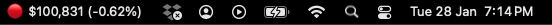
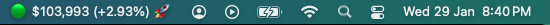

# 🚀🚀🚀 OAB Tray 🚀🚀🚀

A system tray application that tracks and displays the current Bitcoin price in USD, with additional features for price change notifications and animations.



## Features

- 📈 Real-time Bitcoin price tracking from Binance API
- 🖥️ System tray display with price and percentage change
- 🎬 Price change animations for significant movements (≥5%)
- 🚀 "To the Mow-n" mode to display price in millions



## Installation

1. Ensure Go is installed on your system
2. Clone this repository
3. Build the application:
   ```bash
   go build -o oabtray
   ```
4. Run the executable:
   ```bash
   ./oabtray
   ```

## Usage

- The application runs in the system tray
- Click the tray icon to see additional options:
  - Current price and version information
  - Toggle "To the Moon" mode
  - Quit the application
- Significant price changes (≥5%) trigger animations:
  - 🚀 for positive changes
  - 🧂 for negative changes

## Configuration

The application automatically saves its state to:
- `~/bitcoin_tracker_data.gob` - Last known price and settings
- `~/bitcoin_tracker.lock` - Lock file to prevent multiple instances

## Dependencies

- github.com/getlantern/systray
- github.com/gofrs/flock

## License

MIT License
